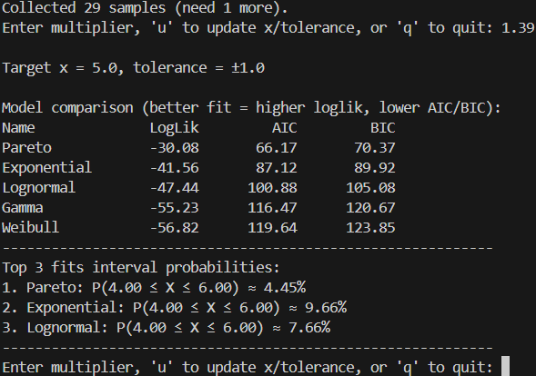
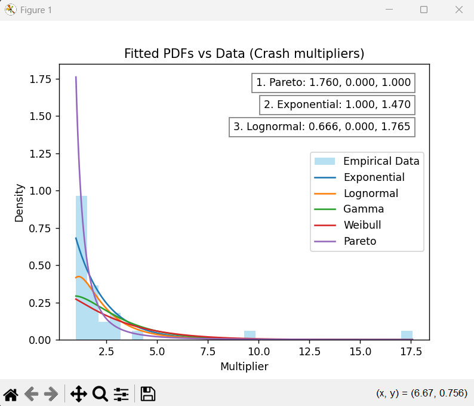

# Crash Distribution Analyzer

A Python tool for analyzing and visualizing the probability distributions of "crash multipliers" (or any numerical dataset).  
It fits multiple candidate distributions (Exponential, Lognormal, Gamma, Weibull, Pareto), compares their performance using **Log-Likelihood, AIC, and BIC**, and plots the fitted probability density functions against the empirical data.  

## ✨ Features
- Interactive input of multiplier values  
- Real-time plotting of fitted distributions  
- Automatic model comparison (AIC/BIC ranking)  
- Interval probability estimation for the top 3 models  
- Clean matplotlib visualizations  


## 📂 Project Structure
```
crash-distribution-analyzer/  
├── assets/  
│ └── data.png   
│ └── plot_example.png   
│ └── start.png   
├── crv/  
│ └── main.py  
├── tests/  
│ └── random_number.py  
├── requirements.txt  
├── README.md  
└── .gitignore
```

## 🔧 Requirements
* Python 3.8+
* Dependencies listed in `requirements.txt` (install with `pip install -r requirements.txt`)

## ⚡ Quick Start
1. Clone the repository
```bash
git clone https://github.com/klabruben3/crash-distribution-analyzer.git
cd crash-distribution-analyzer
```

2. Install dependencies
```bash
pip install -r requirements.txt
```

3. Run the analyzer
```bash
python -m crv.main
```

4. Usage:

   * Enter at least 30 multipliers for distribution fitting to begin.

   * Use:

       * u → update target multiplier and tolerance

       * q → quit

5. Generating Test Data

    If you don’t have your own multipliers to analyze, you can use the included demo script to generate sample data:

```bash
python tests/rand_num.py
```
Follow the prompts to generate random numbers within a specified maximum value.

Commands while running:

* `y` → generate a new random number

* `u` → update the maximum value

* `h` → show all generated numbers so far

* `n` → quit the generator

Use the printed numbers as input in crv/main.py to test the analyzer.

## 📊 Example Output
The program will:

* Display a histogram of your collected data

* Overlay candidate probability density functions

* Rank the best-fitting models (lower AIC/BIC = better)

* Show probability intervals around your target multiplier


## Example run
|Start|Data|
|---|---|
 |  

|Plot Example|
|---|


## 📜 License
This project is licensed under the MIT License – free to use, modify, and share.
